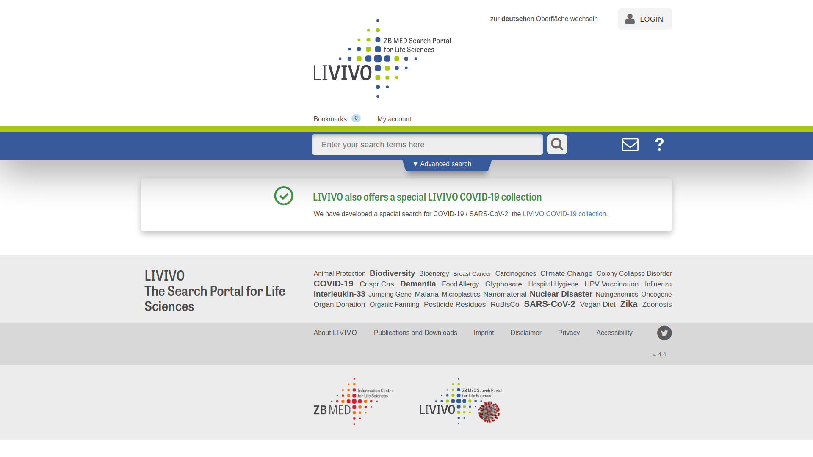

## What is LIVIVO?

The search portal for medicine, health, nutrition, and environmental and agricultural sciences
LIVIVO is an interdisciplinary search engine for literature and information in the field of life sciences. It is run by ZB MED – Information Centre for Life Sciences.

LIVIVO draws on relevant scientific information from the ZB MED subject areas of medicine, health, nutrition, and environmental and agricultural sciences. It enables researchers to find what they need for free using a standardised search interface.
In many cases, items can then be retrieved online, either by accessing them directly or placing an order. We can also arrange for items to be delivered straight to your home using the subito document delivery service. Alternatively, you can request items to be sent to your local library through the inter-library loan service.

Special feature: semantic search technology
LIVIVO uses an index-based search engine featuring specially developed search technology. It looks for your search term in multiple sources simultaneously, searching through library catalogues, publisher directories and other key life science databases such as PubMed, AGRICOLA and AGRIS. Highlights include automated linguistic enrichment and semantic linking of search terms using defined vocabulary specially tailored to the life science arena (using MeSH for medical sciences, UMTHES for environmental sciences and AGROVOC for agricultural sciences). This intelligent search technology helps users quickly find the information they need, producing highly accurate results. The resulting hit list is sorted by relevance and can be narrowed down further using filters such as the ZB MED subject fields of medicine/health, nutrition, and environmental and agricultural science.

## 1.1 Interface of LIVIVO

Let's checkout the Main Page from LIVIVO.
Start by going to the [LIVIVO Main Page](https://www.livivo.de/app) by typing "www.livivo.de" into your browser. This is what you should see:
This is what you should see:

First thing you can do is switch between the german and english interface by clicking "zur deutschen Oberfläche" or "switch to English language"
